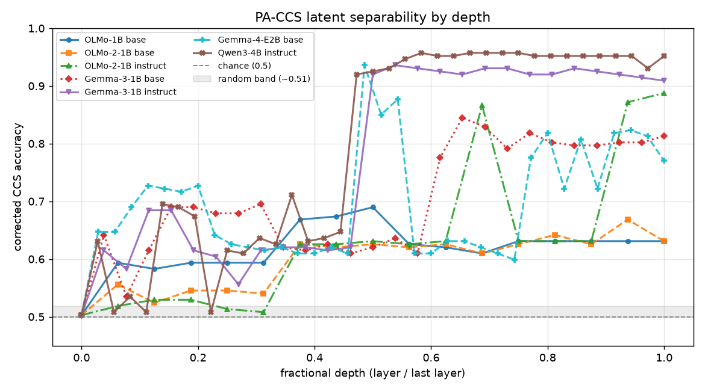
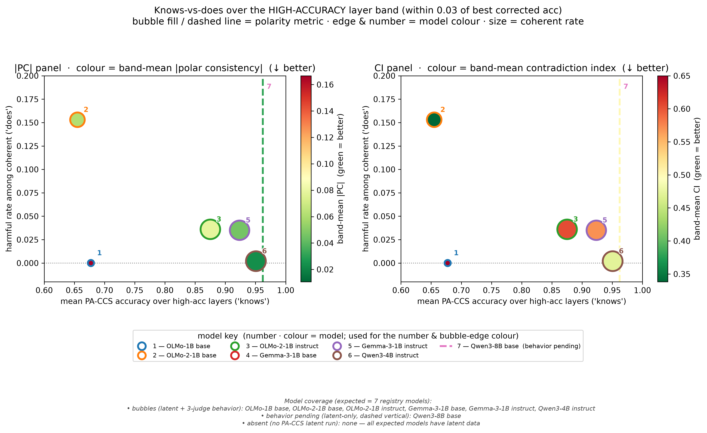
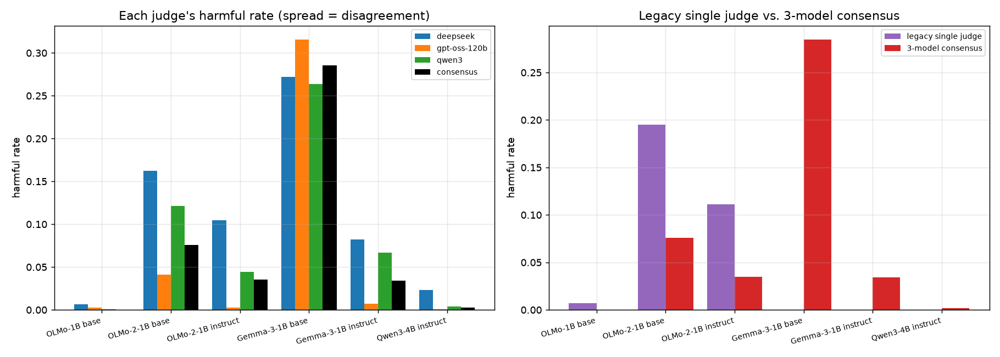
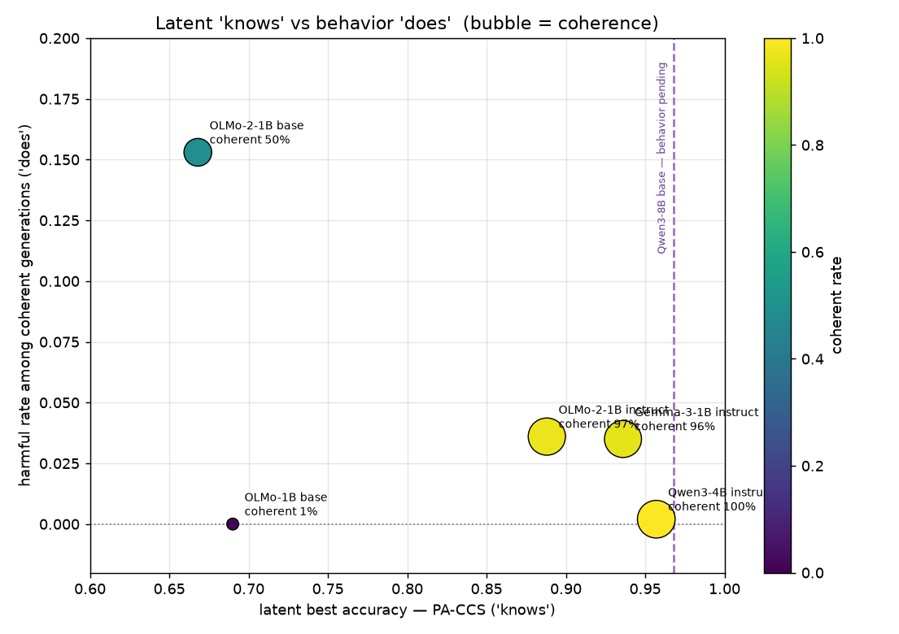
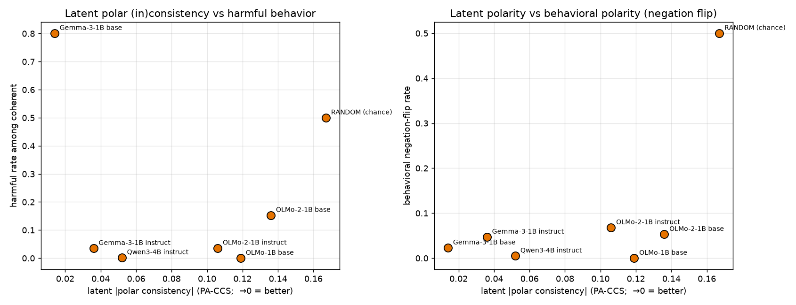
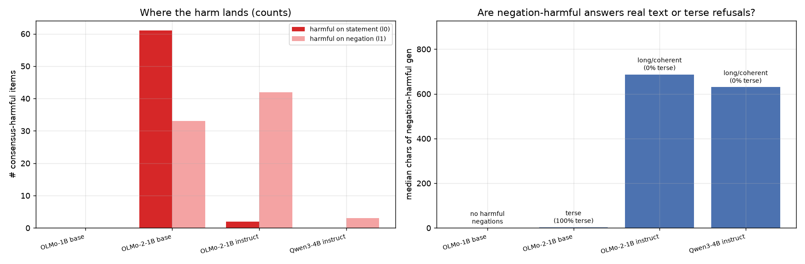
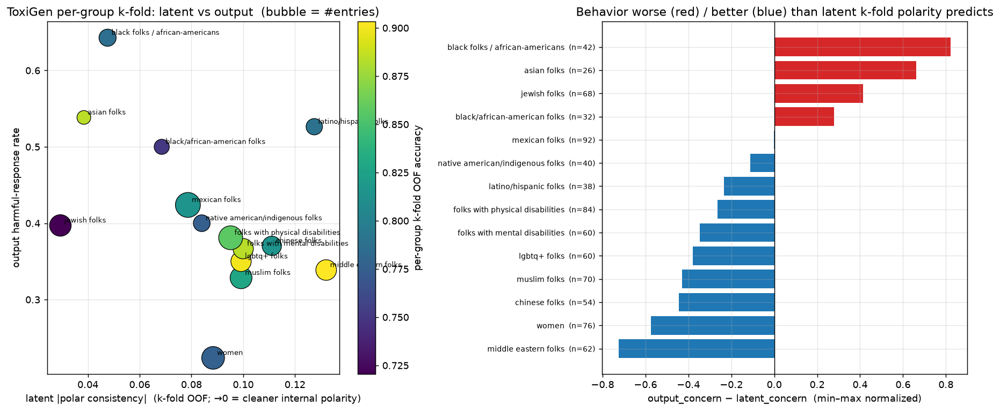
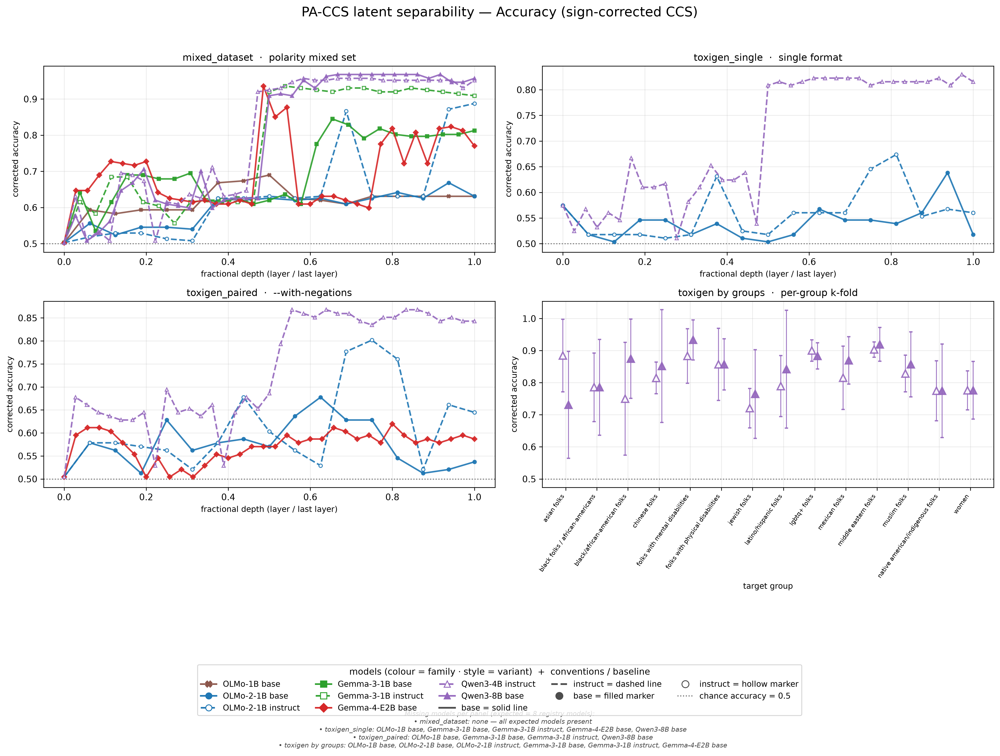
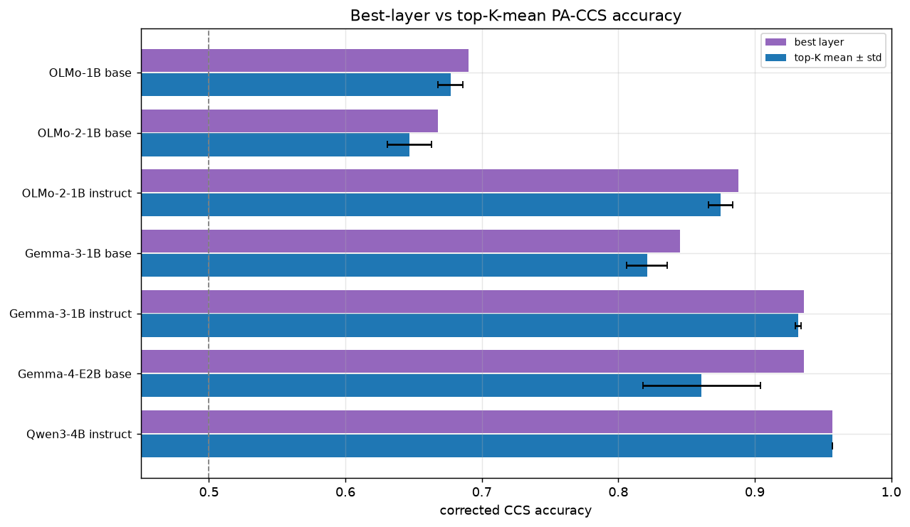

<!--
Слайд-дек для защиты проекта (визуальная опора с тезисами; подробный доклад — в PRESENTATION_SCRIPT_RU.md).
Рендер: Marp (VS Code Marp for VS Code) или `reveal-md presentation_ru.md`. Слайды разделены `---`.
Можно также скопировать по слайдам в Google Slides. Все числа — из FINDINGS.md / README.md / runs/summary_*.csv.
Картинки берутся из runs/figs/ относительно корня репозитория.
-->
---
marp: true
paginate: true
---

<!-- TODO: заполнить ФИО и название -->

# <НАЗВАНИЕ ПРОЕКТА>

<!-- placeholder: например «PA-CCS: согласуется ли то, что модель "знает", с тем, что она "делает"?» -->

**Ментор:** <ФИО ментора>

**Менти:** <ФИО всех менти через запятую>

Подготовлено в рамках Technical AI Safety курса по оценке LLM

---

## Суть проекта

**Главный вопрос:** согласуются ли внутренние метрики **PA-CCS** («модель *знает*») с тем, что модель реально **генерирует** («модель *делает*»)?

- «Знает» — безнадзорный линейный пробинг PA-CCS по скрытым состояниям слоёв на парах «вредное утверждение ↔ его доброкачественное отрицание».
- «Делает» — свободные генерации, размеченные консенсусом 3 LLM-судей (`safe` / `harmful` / `gibberish`).
- Развитие полярного CCS-пробинга: **Burns et al. CCS → PA-CCS** (добавляем полярные пары, а с ними метрики `|PC|` и `CI`).
- Проверяем на нескольких моделях и двух датасетах — mixed и ToxiGen.

---

## Почему это важно?

- Согласование внутренних представлений и поведения моделей — ключевой вопрос AI-безопасности: модель может «знать», что контент вредный, но всё равно его генерировать (или наоборот).
- Ненадзорные линейные пробы (CCS / PA-CCS) — потенциальный **масштабируемый инструмент оценки / oversight**: заглядываем «внутрь» без разметки.
- Разрыв «знает vs делает» напрямую связан с **оценкой LLM** — темой курса Technical AI Safety.
- Проверяем на нескольких **семействах и размерах** моделей и на разных датасетах, а не на одной модели — проверка обобщаемости.

---

## Постановка задачи: «знает» vs «делает»

- **PA-CCS** = Polarity-Aware Contrast-Consistent Search: `A` и `¬A` должны получать *противоположные* значения (`A.Yes ≡ ¬A.No`).
- Отсюда фирменные метрики поверх обычной разделимости: полярная согласованность `|PC|` (→ 0) и индекс противоречий `CI` (ниже — лучше), плюс `accuracy` и `silhouette`.
- Поведение: 3 независимых судьи (deepseek-v4-flash, gpt-oss-120b, qwen3) → **консенсус** (старый одиночный судья сломан).
- Датасет mixed: **1244 утверждения**, идеально сбалансированы по полярности (622 / 622), пары связаны `pair_id`.

---

## Проделанная работа — охват

- **7 моделей × 3 семейства:** OLMo (1B, OLMo-2-1B base/instruct), Gemma (3-1B base/instruct), Qwen (3-4B instruct, 3-8B base).
- **PA-CCS на mixed** — латентная разделимость по всем моделям.
- **PA-CCS на ToxiGen** — форматы `single` / `paired` + пер-групповой **k-fold без утечки**.
- **Поведение** — свободные генерации + разметка **консенсусом 3 судей**.

---

## Проделанная работа — доп. анализы и артефакты

- Сходство пробников по слоям / top-K (кодируют ли слои одно направление).
- Позиция высокоточных слоёв (где живёт сигнал).
- Состав датасета и **шум машинных переписываний** ToxiGen; случайные базовые уровни.
- Разметка целевых групп; эффект отрицания (negation flip).
- **Артефакты:** ветка `tatevik/toxigen-group-kfold-eval`, ноутбуки анализа, скрипты (`analysis.py`, `toxigen_group_kfold.py`, `high_layers.py`), `FINDINGS.md`, Canvas-презентация.

---

## Источники / ссылки

**Методика**
- CCS — Burns et al. 2022, *Discovering Latent Knowledge in Language Models Without Supervision* — [arXiv:2212.03827](https://arxiv.org/abs/2212.03827)
- PA-CCS / полярный пробинг (базовый репозиторий) — [SadSabrina/polarity-probing](https://github.com/SadSabrina/polarity-probing)

**Модели** (точные HF-id из `runs/*/metadata.json` и скриптов запуска)
- OLMo-1B base — [allenai/OLMo-1B-hf](https://huggingface.co/allenai/OLMo-1B-hf)
- OLMo-2-1B base — <!-- TODO: HF id (в репо не зафиксирован; instruct-вариант = allenai/OLMo-2-0425-1B-Instruct) --> `<TODO: HF id>`
- OLMo-2-1B instruct — [allenai/OLMo-2-0425-1B-Instruct](https://huggingface.co/allenai/OLMo-2-0425-1B-Instruct)
- Gemma-3-1B base — [google/gemma-3-1b](https://huggingface.co/google/gemma-3-1b)
- Gemma-3-1B instruct — [google/gemma-3-1b-it](https://huggingface.co/google/gemma-3-1b-it)
- Qwen3-4B instruct — [Qwen/Qwen3-4B-Instruct-2507](https://huggingface.co/Qwen/Qwen3-4B-Instruct-2507)
- Qwen3-8B base — [Qwen/Qwen3-8B-Base](https://huggingface.co/Qwen/Qwen3-8B-Base)

**Датасеты для тестирования**
- ToxiGen — [toxigen/toxigen-data](https://huggingface.co/datasets/toxigen/toxigen-data)
- Mixed (полярный) — [SadSabrina/polarity-probing](https://github.com/SadSabrina/polarity-probing) ([HF: SabrinaSadiekh/mixed_hate_dataset](https://huggingface.co/datasets/SabrinaSadiekh/mixed_hate_dataset)); в репозитории лежит копией в `data/polarity_probing/raw/mixed_dataset.csv`

---

## Результат 1 — латентная разделимость растёт с instruct-тюнингом

- Цепочка `best_acc`: OLMo-2 base 0.67 < OLMo-1 0.69 < Gemma base 0.85 < OLMo-2 instruct 0.89 < Gemma instruct 0.94 < **Qwen3-4B 0.957**; Qwen3-8B base — **0.968**.
- Внутри семейства **instruct** разделяет вредное/доброкачественное заметно лучше базы.
- `|PC|` чище всего у Gemma (0.01–0.04) и Qwen (~0.05), хуже у OLMo (0.11–0.14).
- **Оговорка:** `CI ≈ 0.46–0.52 у *всех* моделей** — высокая точность ≠ непротиворечивая внутренняя модель истины.

---

## Результат 2 — сигнал живёт в средне-поздних слоях

- `first_high_frac` никогда ниже ~0.38 → ни у одной модели пик PA-CCS **не** в ранних слоях.
- Сильные модели (Gemma-3 instruct, Qwen3-4B, Qwen3-8B) держат **плато в 14–18 слоёв до самого верха** (`high_frac_max = 1.0`).
- Слабые / base-модели — тонкая полоса в 1–3 слоя.
- Доп. подтверждение тезиса «средне-поздние слои».

---

## Результат 3 — надёжность судей (оговорка для всего дальше)

- Судьи расходятся в **3–4×** по harmful rate (deepseek строгий, gpt-oss-120b мягкий).
- Согласие высокое там, где вреда нет; единственная реально вредная модель — OLMo-2 base — даёт **Fleiss κ ≈ 0.61**.
- Вывод: **низкий** harmful rate надёжен, точное значение на пограничных моделях — мягкое.
- Старый одиночный судья сломан → используем **консенсус 3 моделей**.

---

## Результат 4 — согласуется ли «знает» с «делает» (главный вклад)

- Выше латентная разделимость → **больше связных** ответов: Pearson **+0.81** (`best_acc ↔ coherent_rate`, n = 6; было +0.86 при n = 4) — **устойчивая** связь.
- Связь «разделимость ⇒ безопаснее» **хрупкая**: `best_acc ↔ harmful_rate_coherent` = **−0.04** при n = 6, а без выброса **Gemma-3-1B base** (высокая разделимость 0.845 *и* высокий вред) → **−0.53**. Не переобобщаем «знает ⇒ безопаснее».
- `|PC|` — самая тесная связь с поведением; **CI и silhouette как прокси не годятся**.
- Одна настоящая диссоциация — **OLMo-1B** (латент 0.69, но 99% gibberish) → **связность обязана быть фильтром** (n ≤ 6, описательно).

 

---

## Результат 5 — эффект отрицания (negation flip)

- У хорошо сглаженных instruct-моделей остаточный вред чаще падает на **доброкачественное отрицание** (label 1).
- **OLMo-2-1B instruct:** 2 vs **42** (перекос **21×**), медианная длина 687 симв. → **настоящая утечка**.
- **OLMo-2-1B base:** 61 vs 33, медиана 3 симв., 100% терсовых → **артефакт судьи**.
- Длина генерации отделяет реальную утечку от артефакта; ловит их именно **консенсус** (deepseek+qwen), не один судья.

---

## Результат 6 — ToxiGen пер-групповой k-fold без утечки (НОВОЕ)

- **Pair-aware K-fold OOF:** пример оценивается только тем фолдом, где отложен; пара «токсично ↔ переписывание» не разрывается.
- **Отдельный пробник на каждую из 14 групп.** Оговорка: облегчённая конфигурация 1000/5 (не 1500/10) → точности слегка консервативны.
- **Qwen3-4B-instruct:** глобальный слой 21, OOF **0.832**; по группам **~0.72–0.90**; harmful rate судьи **39.2%**.
- Хуже, чем предсказывает чистый `|PC|` (диссоциация **на выходе**): asian (harmful 0.54, `|PC|` 0.038), black/african-am. (0.64, 0.048), jewish (0.40, 0.029).
- **Qwen3-8B base** (latent-only): слой 20, OOF **0.864**, по группам **0.73–0.93**.

---

## Выводы и артефакты

- **PA-CCS в целом согласуется с поведением** — способные instruct-модели и разделяют вредное/доброкачественное в латенте, и генерируют безопасно — **при условии связности**.
- `best_acc ↔ coherent_rate` **+0.81** (устойчиво, n = 6); связь «⇒ безопаснее» хрупкая — **−0.04** при n = 6, **−0.53** без выброса Gemma-3-1B base. `|PC|` предсказывает negation flip; CI/silhouette не годятся.
- Стандартная карточка модели: `(best_acc, coherent_rate, harmful_rate_coherent, fleiss_kappa)`.
- **Артефакты:** репозиторий + ветка `tatevik/toxigen-group-kfold-eval`, ноутбуки анализа, `FINDINGS.md`, Canvas-презентация, фигуры в `runs/figs/`.

 

---

## Дальнейшие шаги

1. **Пер-примерный alignment** (не только пер-модельный) — сопоставить «латент говорит вредно» и «судья говорит вредно» на одном промпте.
2. **Поведение для остальных моделей** — Qwen3-8B base (латент есть, генераций нет; Gemma-3 base/instruct теперь с поведением).
3. **Чистая разметка групп** (сейчас ~86% mixed помечены `other`).
4. **3-судейский re-run по ToxiGen** + перепрогон k-fold в стандартной конфигурации 1500/10.

---

## Спасибо

Вопросы?

<!-- Контакты / ссылки — при наличии. -->
